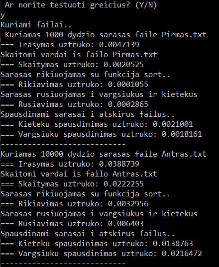

# StudentuRezultatai

**Veikimas:**
  Ši programa sukuria studentų sąrašą, kuris iš vartotojo įvestų rezultatų suskaičiuoja vidurkį arba medianą.;
  

**CHANGELOG**
- V0.1: Sukurtas sąrašą vaizduojantis UI, atsitiktinis pažymių generatorius, patys pažymiai talpinami į dinaminį masyvą. Studentų sąrąšas su galutiniais rezultatais saugomas struktūroje (LinkedList);

- V0.1.1: Namų darbų pažymiai talpinami į vector konteinerį. Kadangi praeitoje versijoje buvo naudojami dinaminiai masyvai, su vektoriais funkcionalumas pagreitėjo, nes masyvo praplatinimui nebereikia ištrinti seno ir kurti naujo masyvo. Vector tipo konteineris automatiškai prasiplečia įdėjus į jį naująjį narį.

- V0.2: Naudojama `using` vietoje `using namespace`, sukurta sąrašo spausdinimo funkcija, kuri spausdina surikiuotą pagal pavardę sąrašą į failą "kursiokai.txt"; Yra pasirinkimas rezultatus skaityti iš failo, kuris failo rezultatus perkelia į stringstream ir iš ten apdoroja duomenis. Idėtas pasirinkimas, ar norite skaičiuoti vidurkį, ar medianą.

- V0.3: Sukurtas header ir cpp failai skirti funkcijoms talpinti. Panaudotas minimaliai "Exception handling".

- V0.4: Sukurtas debugginimo funkcijos, kurios: sukuria penkis atsitiktinius studentų sąrašų failus, sudarytus iš: 1000, 10000, 100000, 1000000, 10000000 įrašų.Sūrušiuoja studentus į dvi kategorijas:  
  Studentai, kurių galutinis balas < 5.0 “vargšiukai”  
  Studentai, kurių galutinis balas >= 5.0 "kietekiai"  
  Surūšiuotus studentai išvedami į du naujus failus "kietekai.txt" ir "vargsiukai.txt"  
  Visos operacijos išmatuojamos, kiek užtrunka ir pateikiamos statistikos konsolėje.  
  
    
 -V0.5: Išbandyti Vector, Deque ir List STL konteinerių veikimo nuskaitymo ir rūšiavimo į 2 kategorijas laikai:  
  
- V0.5.1: Ištestuojamas Vector konteineris, kompiuterio išnaudojami resursai:   
    
    
- V0.5.2: Ištestuojamas Deque konteineris, kompiuterio išnaudojami resursai:  
  
  
- V0.5.3: Ištestuojamas List konteineris, kompiuterio išnaudojami resursai:  
    
  
